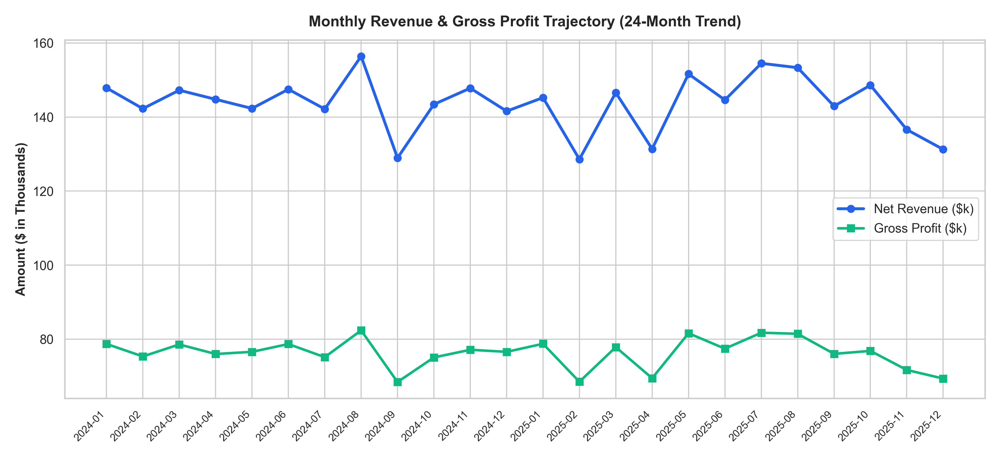
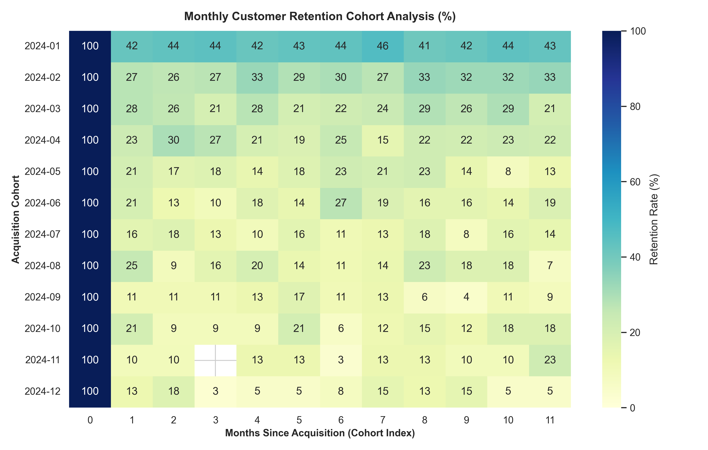
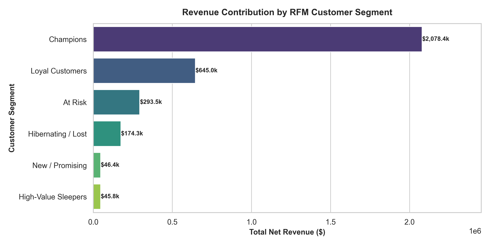
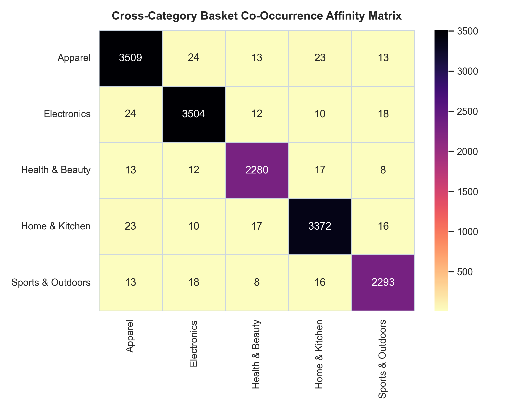

# 📈 DataVoyager — Global E-Commerce & Retail Supply Chain Analytics Pipeline

[](https://www.python.org/)
[](https://numpy.org/)
[](https://pandas.pydata.org/)
[]()

An advanced, production-grade retail and supply chain intelligence engine powered by pure vectorized **NumPy** matrix computations and **Pandas** analytical pipelines. Features multi-year transaction processing, Customer Lifetime Value (CLV) modeling, RFM customer segmentation, monthly cohort retention matrices, inventory safety-stock optimization (GMROI, ITR, ROP), and an interactive HTML executive dashboard.

---

## 📌 Project Highlights

- **Vectorized High-Performance Metrics**: Pure NumPy vectorization for Customer Lifetime Value (CLV), Price Elasticity of Demand, and cross-category basket affinity matrices.
- **RFM Customer Segmentation**: Quantile-based classification into actionable tiers (`Champions`, `Loyal Customers`, `New/Promising`, `At Risk`, `Hibernating`).
- **Cohort Retention Analysis**: Computes 24-month customer retention and revenue decay matrices with automated heatmaps.
- **Supply Chain & Inventory Optimization**: Calculates Inventory Turnover Ratio (ITR), Days of Inventory on Hand (DSI), Gross Margin Return on Investment (GMROI), and Reorder Points (ROP) with 95% service level safety stocks.
- **Interactive Executive Dashboard**: Self-contained HTML report with KPI metric summaries, breakdown tables, and visual analytics figures.
- **Archived Practice Library**: All 111 foundational daily scripts preserved in [`practice_problems/`](practice_problems/).

---

## 🏗️ System Architecture

```
Project-1/
├── practice_problems/           <- Historical daily exercises & practice archive
├── data/
│   └── retail_transactions.csv  <- 15,000+ transaction records
├── src/
│   ├── dataset_generator.py     <- Realistic retail dataset synthesis
│   ├── vectorized_metrics.py    <- NumPy CLV, Price Elasticity, Basket Affinity
│   ├── rfm_segmentation.py      <- RFM scoring & segment profiling
│   ├── cohort_analysis.py       <- Monthly retention cohort matrix engine
│   ├── supply_chain.py          <- Inventory turnover, GMROI & Safety Stock
│   └── dashboard_generator.py   <- Charts generator & Executive HTML Dashboard
├── reports/
│   ├── charts/
│   │   ├── monthly_sales_trend.png
│   │   ├── cohort_retention_heatmap.png
│   │   ├── rfm_customer_distribution.png
│   │   └── product_affinity_heatmap.png
│   └── executive_sales_dashboard.html
├── run_pipeline.py              <- Main single-command orchestrator
└── README.md
```

---

## 🚀 Quick Start

### 1. Run the Analytics Pipeline
```bash
python run_pipeline.py
```

### 2. View the Executive Dashboard
Open `reports/executive_sales_dashboard.html` in your web browser.

---

## 📊 Output Charts

The project generates the following analytics charts from the retail data pipeline:









---

## 📊 Key Analytics Modules
1. **Customer Intelligence**: Projected 12-Month CLV, Average Order Value (AOV), Purchase Frequency.
2. **Behavioral Segmentation**: Recency, Frequency, Monetary (RFM) 5-tier scoring.
3. **Cohort Performance**: Multi-period retention percentages and churn decay tracking.
4. **Supply Chain Operations**: Inventory Velocity, GMROI profitability ranking, and Reorder Point (ROP) thresholds.
